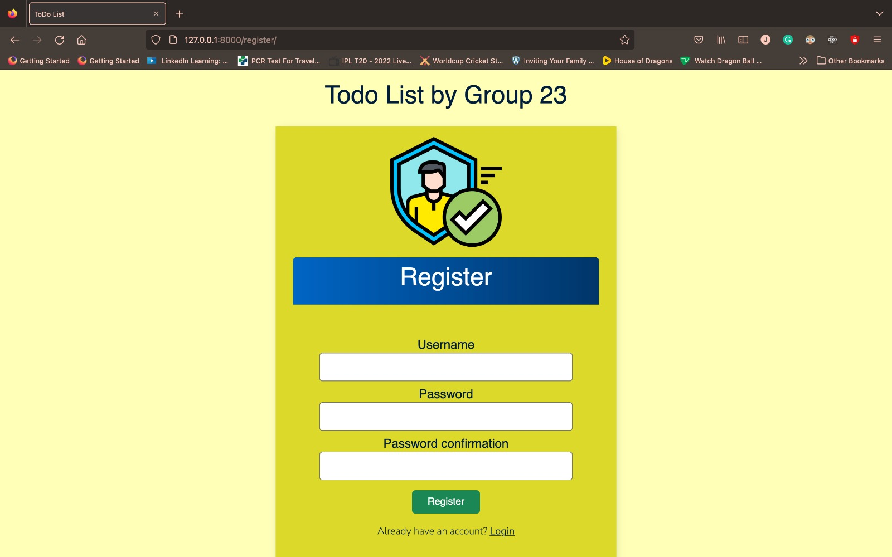

# ToDo_App
 
Created a Todo List with Authentication using Django.
  
Below are the screenshot of the projects:
 
Login Page
 

 
Register
 

 
After Login
 

 
Adding Task
 

 
Task List
 

 
Search Task
 

 
